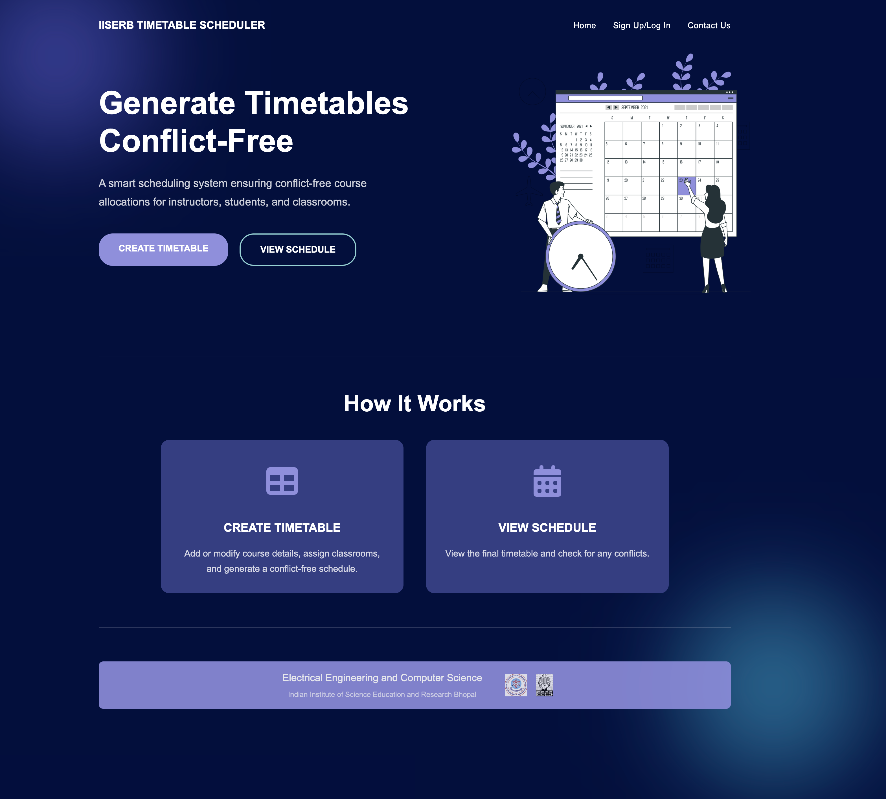
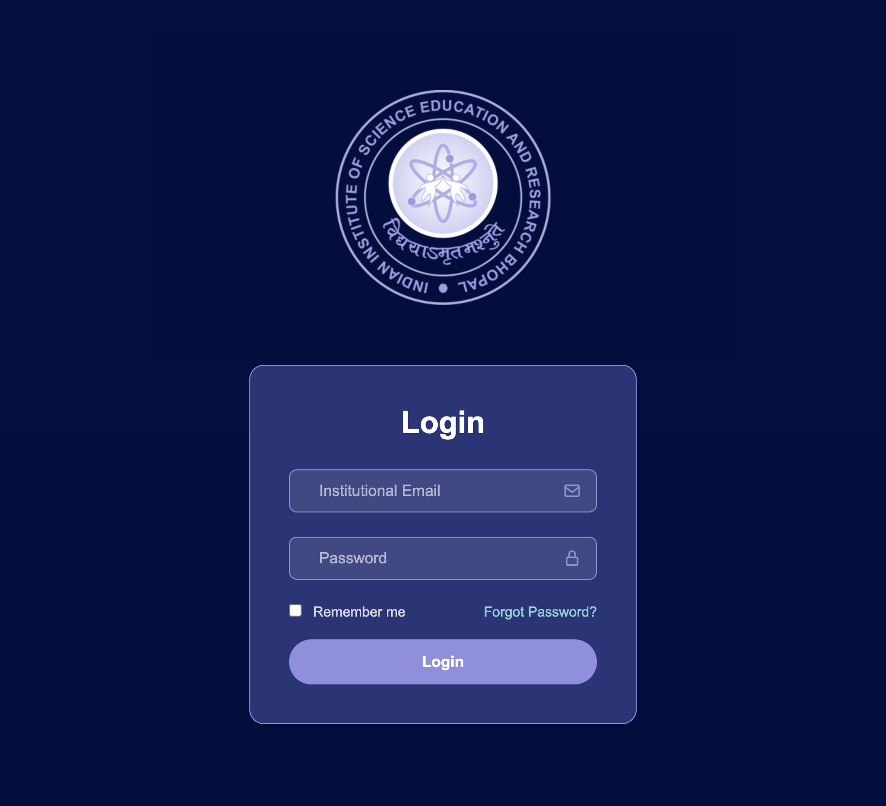
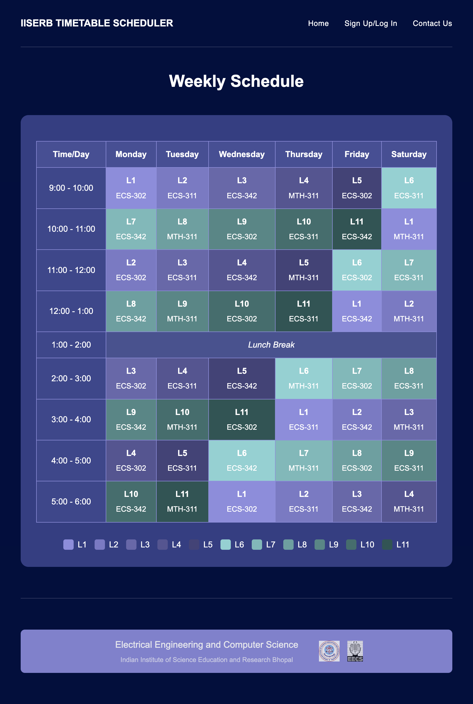

# Timetable Scheduler

## Overview
The **Timetable Scheduler** is a web-based application that allows users to create and view academic timetables efficiently. Users can sign up, log in, and generate conflict-free timetables.

## File Structure

### `index.html`
- The main entry point of the application.
- Landing page with options to **Sign Up** or **Log In**.
- Buttons to navigate to **Create Timetable** and **View Schedule** pages.

### `login.html`
- Users enter their email and password to log in.
- Provides authentication before accessing other features.

### `create-timetable.html`
- Interface to add and modify courses.
- Inputs for course code(that contains information like department and semester), instructor, and maximum student capacity per department.

| Add Course | Edit Course |
|------------|------------|
| .png) | .png) |

### `view-schedule.html`
- Displays a sample weekly timetable.
- Showcases how weekly class schedules appear.

## Languages Used
- HTML
- CSS (internal)

